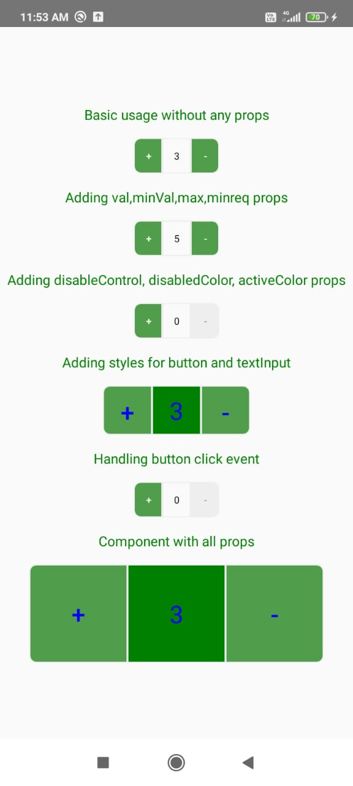

# React Native Increment Decrement Button

React Native Increment Decrement Button is a react-native component for add to cart like functionality.\
It has following functionalities:\
1.initial value support for button\
2.max and min limit support.\
3.Button disabling on max and min limit reach\
4.Complete button disabling support.
5.Custom style support for both button and display text input.

## Visiual example


## Installation

if you have react-native-vector-icons and react-native-paper installed in your project.

```bash
yarn add react-native-increment-decrement-button
```
or with npm

```bash
npm install react-native-increment-decrement-button --save
```
if you don't have react-native-vector-icons and react-native-paper installed in your project

```bash
yarn add react-native-vector-icons react-native-paper react-native-increment-decrement-button
```
or with npm
```bash
npm install  react-native-vector-icons react-native-paper react-native-increment-decrement-button --save
```
if you're experiencing issues with react-native link which is used to install react-native-vector-icons please refer to [react-native-vector-icons](https://github.com/oblador/react-native-vector-icons) to see manual installation steps

## Usage
import component

```javascript
import RnIncrementDecrementBtn  from 
'react-native-increment-decrement-button';
```
Basic usage without any props

```javascript
 <RnIncrementDecrementBtn  />
```
Adding val,minVal,max,minreq props

```javascript
 <RnIncrementDecrementBtn minVal={0} minreq={3} max={10} val={3} />
```
Adding disableControl,disabledColor,activeColor props
```javascript
 <RnIncrementDecrementBtn disableControl={false} disabledColor={'#eeeeee'} activeColor={'#509e4b'} /> 
```
Adding styles for button and textInput

```javascript
<RnIncrementDecrementBtn
        styleBtn={{width:100,height:100}}
        styleTextInput={{width:100,height:100,backgroundColor:'green'}}
        labelStyle={{fontSize:25,color:'blue'}}
      />
```
Handling button click event

```javascript
<RnIncrementDecrementBtn handleClick={()=>console.log('Pressed')}/>

```


Component with all props
```javascript
<RnIncrementDecrementBtn
        minVal={0} 
        minreq={3} 
        max={10}
        val={3}
        disableControl={false}
        disabledColor={'#eeeeee'}
        activeColor={'#509e4b'}
        handleClick={()=>console.log('Pressed')}
        styleBtn={{width:100,height:100}}
        styleTextInput={{width:100,height:100,backgroundColor:'green'}}
        labelStyle={{fontSize:25,color:'blue'}}
      />
```

## Props
Name | Type | Default
-----|------|--------
**val**| `number`|0
**minVal**|`number`| 0
**max**|`number`|100
**disableControl**|`boolean`|none
**minreq**|`number`|none
**handleClick**|`function`| none
**styleTextInput**|`object`| justifyContent: 'center',alignItems: 'center',fontSize: 18,borderWidth: 1, borderColor: '#eeeeee',height: PixelRatio.roundToNearestPixel((height * 5) / 100), width: PixelRatio.roundToNearestPixel((width * 8) / 100),
**styleBtn**|`object`|justifyContent: 'center',alignItems: 'center',    borderWidth: 1,    borderColor: '#eeeeee',    height: PixelRatio.roundToNearestPixel((height * 5) / 100),    width: PixelRatio.roundToNearestPixel((width * 8) / 100), borderTopRightRadius: PixelRatio.roundToNearestPixel((height * 1) / 100), borderBottomRightRadius: PixelRatio.roundToNearestPixel((height * 1) / 100),
**disabledColor**|`string`|#eeeeee
**activeColor**|`string`|#509e4b
**labelStyle**|`object`|fontSize:10

## About props
* val - value to be consider in the component state, if value is not given as a prop default 0 is taken.
* minVal - minimun bound to decrement value.
* max - maximum bound to which value to be incremented.
* disableControl - prop to completely disable both buttons,useful incase of api calls.
* minreq - minimum initial value to be present
* handleClick(val) - function which takes value as param ,called when either button is clicked
* styleTextInput - prop to apply custom style to view in which value is displayed
* styleBtn - prop to apply custom style for buttons like width,height etc.
* disabledColor - color to heighlight button disable when bound is reached
* activeColor - color to showup buttons
* labelStyle - prop to apply custom style for labels.It takes StyleProp <TextStyle> such as fontSize,color etc.

## Contributing
Pull requests are welcome. For major changes, please open an issue first to discuss what you would like to change.


## License
[MIT](https://choosealicense.com/licenses/mit/)
